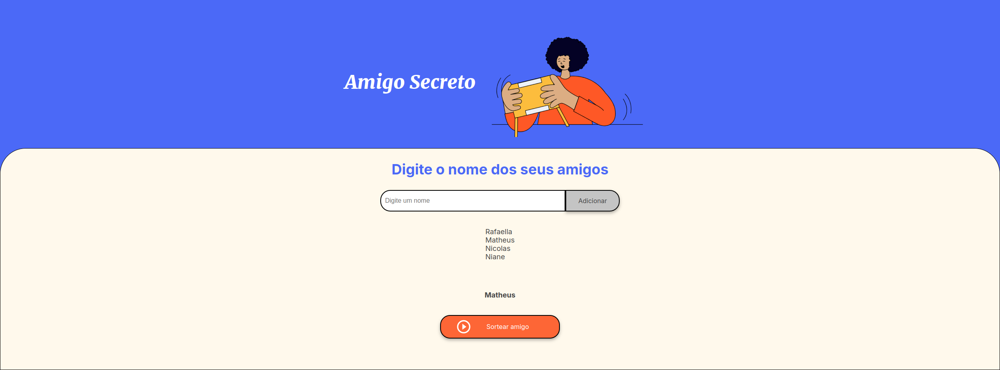

# 🦋 ONE - Desafio Amigo Secreto



#

**` 🚀 Visão geral:`**

🎯 **Objetivo:**

O **Amigo Secreto** é um projeto simples que permite adicionar nomes a uma lista e sortear um deles aleatoriamente. O objetivo é praticar conceitos básicos de **HTML, CSS e JavaScript**.


💻 **Funcionalidades:**

- Adicionar e exibir nomes à lista.

- Sortear um nome dentro dessa lista.

- Exibir nomes sorteados aleatoriamente dentro da lista. 

##

## 🌎 **Acesse o projeto online:**  
🔗 [**`Clique aqui para abrir o Amigo Secreto`**](https://rafaella-monteiro.github.io/Desafio-amigo-secreto/)


---

## 🚀 Como Rodar o Projeto Localmente:

Siga os passos abaixo para configurar e executar o projeto na sua máquina:


### **1️⃣ Clone e acesse o repositório**

**``Execute o comando abaixo no terminal:``**

```bash
git clone https://github.com/Rafaella-Monteiro/Desafio-amigo-secreto.git


```

### **2️⃣ Abra a pasta do projeto:**

```bash
cd Desafio-amigo-secreto
``` 

## **Abra o arquivo index.html no navegador:**

- Você pode clicar duas vezes no arquivo index.html 

- Rodar um servidor local com o VS Code:

🛠 **Tecnologias utilizadas**

- HTML
- CSS
- JavaScript

📂 amigo-secreto
│── 📂 assetes  → mídias utilizadas no projeto
│── index.html  → Estrutura da página
│── style.css   → Estilos da página 
│── app.js      → Código JavaScript
└── README.md   → Instruções do projeto


##
## 🦋 Feito por Rafaella Monteiro
